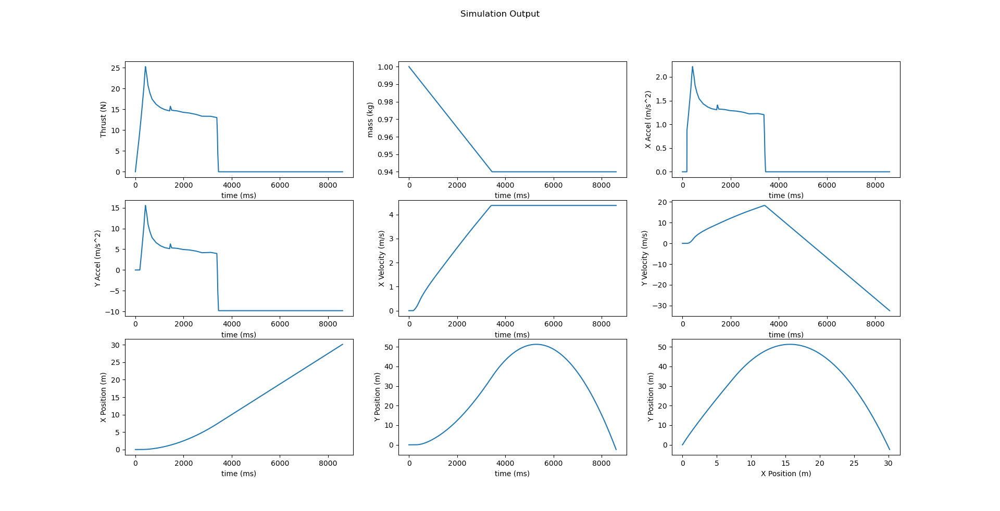

# TVC Simulation
**The simulation does not currently support TVC** \
2D simulation of the flight of a rocket with an Estes-15 motor. 

## Parameters:
- **Angle (deg)**: Trajectory angle of the rocket
- **Rocket Mass (kg)**: Wet mass of the rocket before flight (default 1.0)
- **Simulation duration (sec)**: How much time will elapse for the simulation
- **Step time (sec)**: How long between calculations

## Current Output

